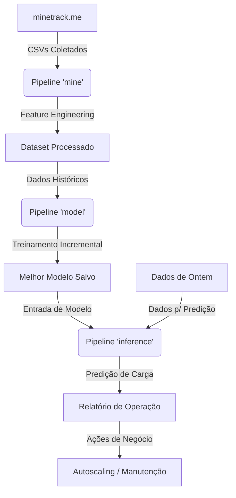

# Mine Tracker Documentation 🚀

Este projeto é uma plataforma de análise preditiva para servidores Minecraft, construída com o framework **Kedro**. Ele automatiza a coleta de dados de contagem de jogadores, engenharia de atributos (features), treinamento de modelos de Machine Learning de larga escala e geração de relatórios operacionais.

## 🏗️ Arquitetura do Sistema

O projeto está dividido em três pipelines principais:

## 📂 Estrutura de Documentação

- [**Problemas Resolvidos**](problem_statement.md): O que este projeto resolve e por que é importante.
- [**Pipelines**](pipelines.md): Explicação detalhada de cada etapa do fluxo de dados.
- [**Arquitetura Técnica**](architecture.md): Diagramas e escolha de tecnologias.
- [**Ações de Negócio**](business_actions.md): Como as predições se transformam em decisões operacionais.

## 🛠️ Tecnologias Utilizadas

- **Kedro**: Orquestração de pipelines de dados.
- **Pandas**: Manipulação de dados e Feature Engineering.
- **Scikit-Learn**: Modelagem preditiva (SGDRegressor, RandomForest).
- **Joblib**: Persistência de modelos.
- **Requests**: Coleta de dados via API/HTTP.
