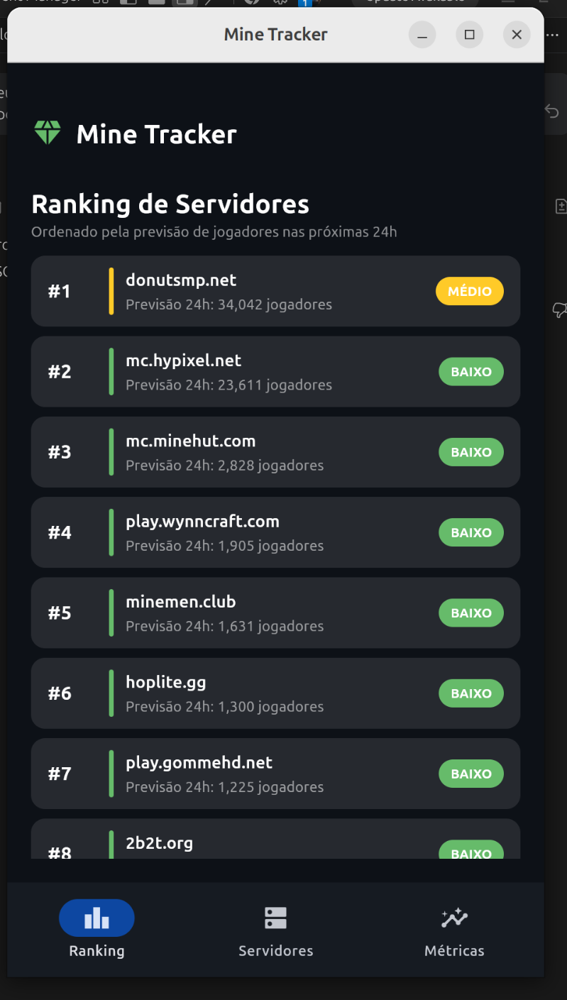
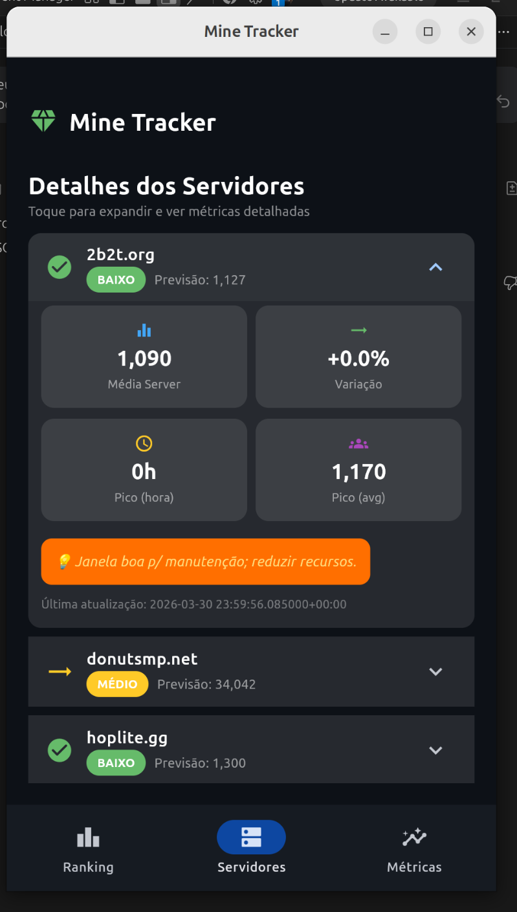
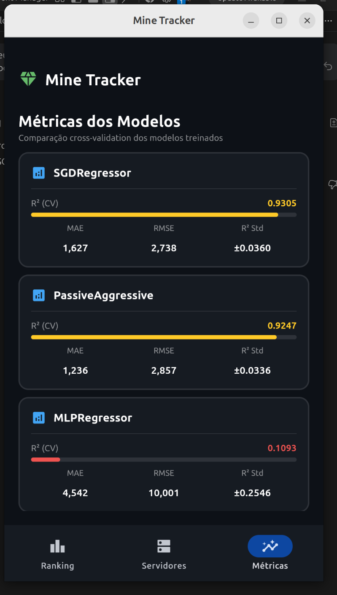
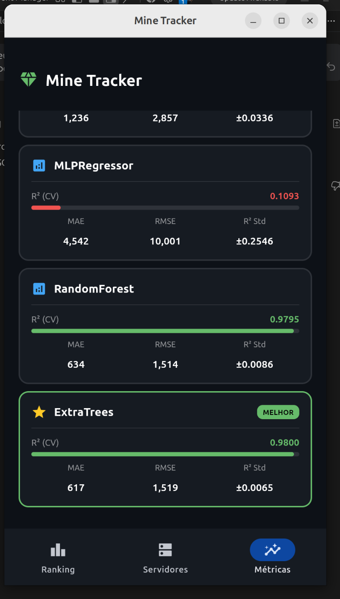

# ⛏️ Mine Tracker — Mobile App

Dashboard mobile construído com [Flet](https://flet.dev/) para monitoramento em tempo real de servidores Minecraft, consumindo dados de previsão de jogadores (D+1) gerados pelo pipeline de ML do projeto.

## 📱 Screenshots

### Ranking de Servidores
Classificação dos servidores ordenada pela previsão de jogadores nas próximas 24h, com badges coloridos por nível de demanda.



---

### Detalhes dos Servidores
Cards expansíveis com métricas detalhadas: média de jogadores, variação percentual, horário de pico, e ação recomendada pelo modelo.



---

### Métricas dos Modelos ML
Comparação visual dos modelos treinados via cross-validation, com barras de progresso para R², MAE, RMSE e desvio padrão. O melhor modelo é destacado automaticamente.





---

## 🚀 Como Rodar

### Desktop
```bash
cd mobile
flet run
```

### Android (via Flet App)
1. Instale o app **Flet** na [Google Play Store](https://play.google.com/store/apps/details?id=com.appveyor.flet)
2. Rode no PC:
   ```bash
   flet run --android
   ```
3. Escaneie o QR code exibido no terminal com o app Flet

### Web
```bash
flet run --web --port 8550
```

## 📂 Estrutura

```
mobile/
├── main.py                   # App Flet principal
├── metricas.json             # Métricas dos modelos (gerado pelo pipeline)
├── report_inference.json     # Relatório de inferência (gerado pelo pipeline)
└── README.md
```

## 🛠️ Tecnologias

- **[Flet](https://flet.dev/)** — Framework Python para apps multiplataforma (desktop, mobile, web)
- **Python 3.13**
- Dados gerados pelo pipeline **Kedro** do projeto `mine-tracker`

## 📊 Dados Consumidos

| Arquivo | Descrição |
|---------|-----------|
| `metricas.json` | R², MAE, RMSE de 5 modelos (SGD, PassiveAggressive, MLP, RandomForest, ExtraTrees) |
| `report_inference.json` | Ranking, clusters, previsões 24h e séries históricas de 14 servidores Minecraft |